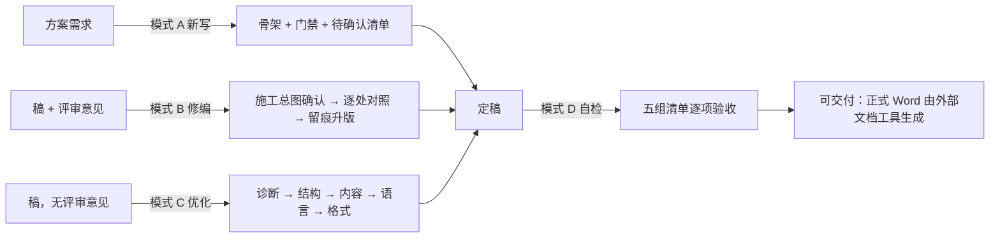

# solution-writing-standard（方案编写与优化 Skill）

<p align="center">
  <strong>把「方案怎么写、怎么改、怎么打磨、交付前怎么查」固化成条款，让 AI 写方案受统一规范约束。</strong>
</p>

<p align="center">
  四模式一个入口：新写 · 改稿修编 · 草稿优化 · 交付自检。确认门、语料验证、脚本三重验证，改动全程留痕。
</p>

<p align="center">
  <a href="#快速开始">快速开始</a>
  ·
  <a href="#为什么不同于直接让-ai-写">差异对比</a>
  ·
  <a href="#包含什么">包含什么</a>
  ·
  <a href="CHANGELOG.md">版本沿革</a>
</p>

<p align="center">
  
  
  
</p>

> 这是一个文档方法类 Skill。它不会把无法确认的信息写成事实，不会替使用者做业务判断，动正文之前必须过确认门。

## 适合谁

- 要提交评审、试点或验收的方案类文档：实施方案、建设方案、落地方案、标准规范说明。
- 有评审意见要逐条闭环，需要留修订痕迹与版本对照。
- 有草稿要持续打磨到可交付，需要体检报告和分层优化，而不是一次性重写。
- 想让 AI 写稿受统一规范约束，避免模板腔、AI 味和凭空编造。

不适合：内部备忘、汇报材料、纯技术文档；只想润色一段文字、不涉及文档结构与方法；需要代签评审结论或代做业务判断的场景。

## 你会得到什么

| 你的输入 | 走哪个模式 | 产出 |
| --- | --- | --- |
| 从零开始的方案需求 | A 新写 | 符合规范骨架与门禁的方案稿 + 文档控制表 + 待确认事项表 |
| 评审意见，或待修订的稿子 | B 改稿修编 | 改前快照 + 修订施工总图 + 逐处对照清单 + 升版定稿 + 修订留痕 |
| 一份草稿（无评审意见） | C 草稿优化 | 四层体检报告 + 四轮管线（结构→内容→语言→格式）+ 问题清单 + 对照表 + 验证报告 |
| 一份接近交付的方案 | D 交付前自检 | 逐项检查报告（通过 / 不通过 / 证据位置），不静默跳过任何一项 |

它关注的不是「生成一篇看起来完整的方案」，而是每条依据可溯源、每处改动可对照、每次修订可回滚。

## 为什么不同于直接让 AI 写

| 直接让 AI 写 | solution-writing-standard |
| --- | --- |
| 结构每次现想，容易模板腔 | 套用固定骨架条款：文档控制→建设总览→…→待确认→附录 |
| 依据可能凭空编造 | 依据四类溯源（权威材料/行业方法论/项目材料/推断），无出处一律标「待确认」 |
| 新词随口造，越改越 AI 味 | 术语过语料验证，语料零命中的词不进正文；替换词本身也要有出处 |
| 说改了，未必真改 | 修订做存在性抽检；术语替换三重验证：旧词零残留、新词就位、结构块数不变 |
| 改动无痕迹，回滚靠记忆 | 改前快照 + 施工总图 + 逐处对照 + 修订历史，版本纪律全程执行 |
| 口径和措辞混在一起改 | 通俗化翻译不动口径，口径变更走单独确认，两条线不夹带 |

## 快速开始

### 1. 安装

把仓库内容放进 skills 目录：

```
<项目根>/.opencode/skills/solution-writing-standard/
```

### 2. 按需确认依赖

- **A 新写、B 改稿、D 自检**：纯 Markdown，装完即可用，零依赖。
- **C 草稿优化的语言层、B 模式术语批量替换**：需要 Python 3，仅标准库（argparse/json/re 等），无需安装第三方包。

不使用语言层的场景不必配置 Python；不需要先配置任何无关组件。

### 3. 说一句话

| 你要做什么 | 说一句 |
| --- | --- |
| 从零写方案 | 「帮我新写一份实施方案，先给我施工骨架和待确认清单」 |
| 按评审意见改稿 | 「这是评审意见（附件），先出施工总图给我确认，不要直接改正文」 |
| 草稿整体打磨 | 「这是我的方案草稿，优化到可交付」 |
| 术语与 AI 味清理 | 「这份方案帮我做一轮去AI味，语料在 <目录>，先出对照表给我确认」 |
| 交付前过一遍清单 | 「方案要交付了，按规范把自检清单过一遍，给我逐项报告」 |

## 工作流闭环



模式 B 的强制顺序，跳步即违规：留快照 → 施工总图 → 确认后动正文 → 逐处对照 → 留痕升版 → 抽检验证。

确认门是工作流的一部分，不是对生成结果不信任后的补救措施：施工总图、语言层对照表、轮次计划，都要确认后才动正文。每轮结束给小结，由使用者决定继续、跳过或停止；上一轮已确认的结论下一轮不推翻。

单轮专项直接进对应步骤，不必跑全四轮：只去AI味、只查行业歧义词、只压页数、打分制改勾选式。

## 包含什么

| 文件 | 内容 | 什么时候必读 |
| --- | --- | --- |
| `SKILL.md` | 入口：四模式工作流、硬约束 14 条 | 始终 |
| `references/方案编写通用规范.md` | 规范全文：10 类条款 + 附录 A 自检清单 | 条款解释一律以它为准 |
| `references/去AI味与术语对齐操作指引.md` | 语料分级与命中率判定、五步清理流程、误杀保留参考、三重验证、页数压缩三轮法 | 涉及术语替换或 AI 味清理 |
| `references/草稿优化管线.md` | C 模式细则：输入三档处理、接稿诊断、四轮管线、语言层五步 | 走 C 模式时 |
| `templates/交付模板集.md` | 8 套骨架：文档控制表、本版变化表、施工总图、待确认事项表、角色 RACI 等 | 需要产出表格式交付物 |
| `scripts/` | 三脚本：`term_scan.py`（三层扫描）、`fix_terms.py`（断言后替换）、`check_terms.py`（三重验证） | C 模式语言层、B 模式术语批量替换 |
| `examples/` | 端到端最小示例：示例稿 + 语料 + 配置，scan→对照→fix→check 全链路演示 | 首次使用脚本时 |
| `CHANGELOG.md` | 版本沿革（含两个前身技能的完整历史） | 了解演进 |

## 硬约束（14 条的分组摘要）

- **红线**：禁止虚构；不自造词（替换词必须有语料出处）；口径与通俗化两条线；修订历史不改；不承诺工期。
- **确认门**：覆盖已有文件前必须确认并留快照；施工总图 / 对照表未经确认不动正文；术语替换先于追加修订历史行；语言层缺语料不开工。
- **轮间纪律**：每轮小结由使用者决定去留；上轮结论不推翻；每轮留痕。
- **边界与保守**：不代签评审结论、不代业务判断；低频词不做机器判定，归入人工通读层。

## 支持的场景与边界

| 场景 | 输入 | 关键边界 |
| --- | --- | --- |
| A 新写 | 方案需求 | 缺材料的步骤标「待确认」，不臆造；不给硬工期 |
| B 改稿修编 | 稿 + 评审意见 | 施工总图未确认不动正文；修订留痕升版，不虚构修订记录 |
| C 草稿优化 | 稿 + 语料目录 | 语言层缺语料不开工；只动表达不动口径 |
| D 交付前自检 | 定稿 | 只出检查报告不改内容；排版渲染由外部文档工具完成 |

规范条款针对文档方法与流程，与具体业务领域无关；具体业务内容（名称、责任人、数据、系统配置）由执行方确认，不由本 Skill 假定。

## 常见问题

| 现象 | 优先检查 |
| --- | --- |
| 语言层不开工，只收到一份缺失清单 | 语料目录是否提供（缺语料不开工是硬约束）；语料优先级：委托方制度 > 招投标文件 > 国标行标 > 行业方案 |
| 担心「说改了实际没改」 | B 模式第 6 步存在性抽检；术语类看 `check_terms.py` 三重验证结果 |
| 替换后文档控制表里仍有旧词 | 修订历史区是历史记录，不随改名而改；`check_terms.py` 用 `body_start` 排除该区做零残留检查，属合法保留 |
| 有语料出处的行业词被标成候选 | 对照表确认门人工裁决；语料命中的词自动放行（示例见 `examples/`，行业词「闭环」不被误杀） |
| 改完方案需要正式 Word 版 | 走外部文档工具生成，本 Skill 不做排版渲染 |
| 只有一段话想润色 | 不适用本 Skill：它面向文档结构与方法，不是自由文本润色工具 |

## 项目结构与验证

```text
SKILL.md            入口：四模式工作流 + 硬约束 14 条
references/         规范全文 / 去AI味指引 / 草稿优化管线细则
templates/          8 套交付模板骨架
scripts/            term_scan / fix_terms / check_terms（纯标准库）
examples/           端到端最小示例（示例稿 + 语料 + pairs/check 配置）
CHANGELOG.md        版本沿革
```

维护者验证命令（从仓库根目录执行）：

```powershell
python -X utf8 scripts/term_scan.py examples/target/sample_doc.md examples/corpus --top 10
python -X utf8 scripts/fix_terms.py examples/pairs.json --dry-run
python -X utf8 scripts/check_terms.py examples/check.json
```

预期：扫描报告含生造词候选（语料零命中）与隐喻词命中（放行）；替换断言 4 条全过（dry-run 不写回）；三重验证 9 PASS / 0 FAIL。

## 版本与维护

当前版本 **v2.0.0**，以 `SKILL.md` 的 `metadata.version` 为准。

<details>
<summary>v2.0.0 变化明细</summary>

与 solution-doc-standard v2.1.0 融合为四模式全生命周期助手；触发词合并去重；硬约束 5+13 条合并为统一编号 14 条；五组自检清单单源化到规范附录 A；语言层三层归一（五步入口 + 指引母本 + 脚本实现）；新增 `references/草稿优化管线.md`、`scripts/`、`examples/` 与 `CHANGELOG.md`。完整沿革见 [CHANGELOG.md](CHANGELOG.md)。

</details>

- **升版规则**（沿用《方案编写通用规范》八.3）：定义、边界、类型、责任发生影响兼容性变化时升主版本；补充说明或非语义调整时升次版本。
- **修订流程**（沿用规范七.1、七.9）：先出施工总图，确认后才动正文；大改前留改前快照，支持对比与回退。
- **版本号同改**：`metadata.version`、本文件与 `CHANGELOG.md` 须同步修改。
- **不设文档控制表**：本仓库是 Skill 源码而非交付文档，版本变化以 `metadata.version` 与提交历史为准；提交信息写明「改了什么」与「为什么改」。
- **内容边界**：条款只针对文档方法与流程，不承载具体业务内容、具体使用者信息与具体系统配置。

## 许可

[MIT](LICENSE)
